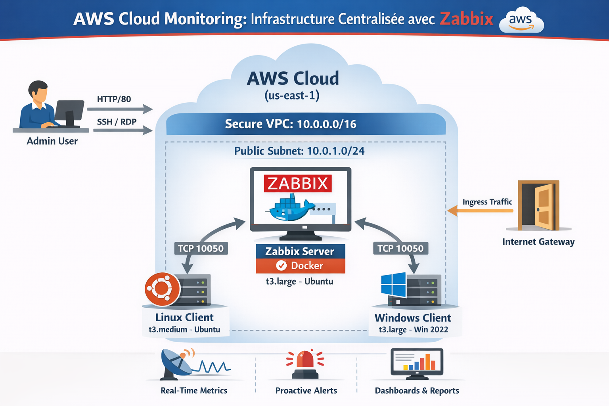
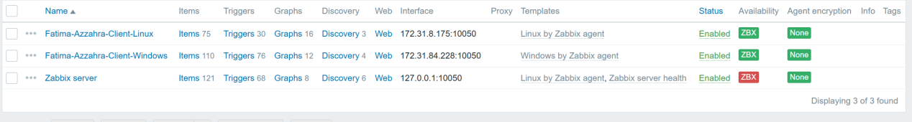

# 🛡️ AWS Cloud Monitoring : Infrastructure Centralisée avec Zabbix


---

## 👩‍💻 Informations Générales

* **Auteur :** Fatima-Azzahra Hamdaoui
* **Filière :** Ingénierie Informatique – Big Data et Cloud Computing (II-BDCC)
* **Encadrant :** Pr. Azeddine KHIAT
* **Projet :** Finalisation de Semestre – Virtualisation & Cloud Computing

---

## 📑 Vue d'ensemble

Ce projet consiste à mettre en place une **solution de supervision centralisée** dans le Cloud AWS à l’aide de **Zabbix 7.0 LTS**, déployé dans un environnement **Dockerisé**.

L’infrastructure permet la surveillance d’un parc **hybride Linux & Windows**, avec un accent particulier sur :

* 📡 La collecte de métriques en temps réel
* 🔔 L’alerting proactif basé sur des seuils critiques
* 📊 La visualisation via des dashboards dynamiques

L’objectif principal est d’assurer la **disponibilité**, la **performance** et la **fiabilité** des ressources Cloud.

---

## 🏗️ Architecture & Topologie Réseau

Le déploiement est réalisé dans la région **AWS us-east-1**, à l’intérieur d’un **VPC sécurisé**.


---

## 🔐 Sécurité – Security Groups

La sécurité est assurée par une **restriction stricte des flux réseau entrants**.

| Instance       | Security Group | Ports ouverts | Source        | Description              |
| -------------- | -------------- | ------------- | ------------- | ------------------------ |
| Serveur Zabbix | SG-Zabbix-Srv  | 80 / 443      | Anywhere      | Interface Web            |
|                |                | 22            | Admin IP      | SSH                      |
|                |                | 10051         | VPC CIDR      | Réception données agents |
| Client Linux   | SG-Linux-Ag    | 22            | Admin IP      | SSH                      |
|                |                | 10050         | SG-Zabbix-Srv | Agent Zabbix             |
| Client Windows | SG-Windows-Ag  | 3389          | Admin IP      | RDP                      |
|                |                | 10050         | SG-Zabbix-Srv | Agent Zabbix             |

---

## 🛠️ Stack Technologique

| Composant        | Technologie             | Détails                |
| ---------------- | ----------------------- | ---------------------- |
| Cloud            | AWS EC2                 | Instances T3           |
| OS Serveur       | Ubuntu 24.04 LTS        | Support Docker         |
| Conteneurisation | Docker & Docker Compose | Isolation des services |
| Monitoring       | Zabbix                  | Version 7.0 LTS        |
| Base de données  | MySQL                   | Stockage des métriques |

---

## 🚀 Guide de Déploiement

### 1️⃣ Déploiement du Serveur Zabbix

Connexion à l’instance **Fatima-Azzahra-Zabbix-Server**.

```bash
sudo apt update && sudo apt install docker.io docker-compose -y
sudo usermod -aG docker $USER && newgrp docker

mkdir zabbix-deploy && cd zabbix-deploy
# Création du fichier docker-compose.yml
docker-compose up -d
```

---

### 2️⃣ Installation des Agents Zabbix

#### 🐧 Client Linux (Ubuntu)

```bash
wget https://repo.zabbix.com/zabbix/7.0/ubuntu/pool/main/z/zabbix-release/zabbix-release_7.0-2+ubuntu24.04_all.deb
sudo dpkg -i zabbix-release_7.0-2+ubuntu24.04_all.deb
sudo apt update && sudo apt install zabbix-agent -y
```

Configuration du fichier `/etc/zabbix/zabbix_agentd.conf` :

```ini
Server=<IP_PRIVEE_ZABBIX>
ServerActive=<IP_PRIVEE_ZABBIX>
Hostname=Fatima-Azzahra-Client-Linux
```

---

#### 🪟 Client Windows Server

* Installation via MSI officiel Zabbix Agent
* Paramètres :

  * Zabbix Server IP : `<IP_PRIVEE_ZABBIX>`
  * Port : `10050`
  * Hostname : `Fatima-Azzahra-Client-Windows`

Vérification via **services.msc**.

---

## 📊 Stratégie de Monitoring

### 🔹 1. Santé Système

* CPU : charge, context switches
* RAM : mémoire disponible, swap
* Disque : espace libre, IOPS

### 🔹 2. Disponibilité

* Ping ICMP
* Zabbix Agent Ping
* Services critiques (SSH, Docker, RDP)

### 🔹 3. Alerting

| Niveau      | Condition               |
| ----------- | ----------------------- |
| 🚨 Désastre | Serveur Down            |
| 🔴 Haute    | CPU > 90% pendant 5 min |
| 🟡 Warning  | Disque < 20%            |

---

## 📸 Preuves de Fonctionnement

### ✅ Tableau de Bord Global

* Tous les hôtes visibles
* Statut **Available (vert)**

---

### 📈 Analyse des Performances

* Graphiques temps réel
* Exemple : consommation CPU sur client Windows

---

## ✅ Conclusion

Ce projet démontre la mise en œuvre complète d’une **solution de supervision Cloud professionnelle**, intégrant :

* Infrastructure AWS sécurisée
* Supervision centralisée avec Zabbix
* Agents Linux & Windows
* Alerting intelligent et dashboards exploitables

Il constitue une base solide pour des environnements **Cloud, DevOps et SRE** à l’échelle industrielle.
"# Projet-Zabbix-AWS" 
"# Projet-Zabbix-AWS" 
